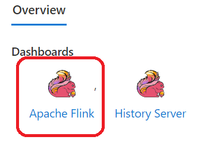
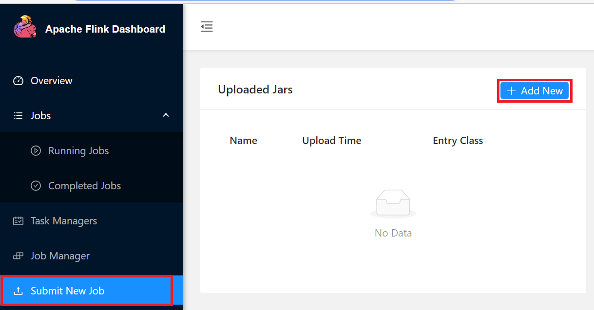
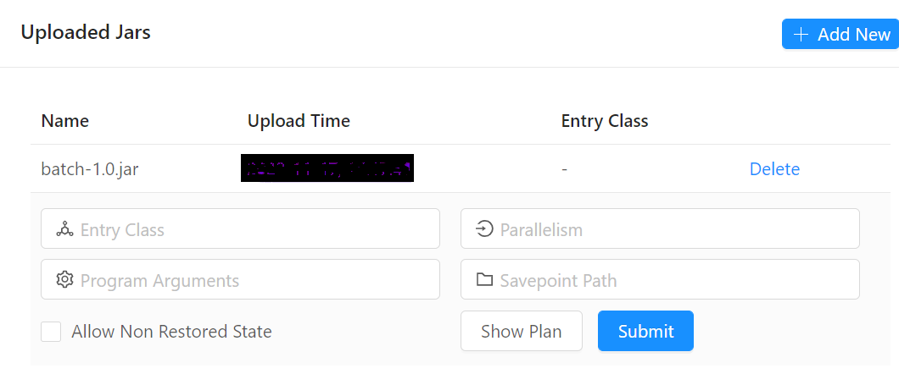

## Running Batch Example

You can submit the Flink job from the Azure portal in a couple of ways:

### Using Flink Dashboard

- Browse Flink Dashboard from Cluster Pool (created in Platform Setup step#4)
- Select the Flink Cluster
- Open Flink Dashboard from "Apache Flink"

- Click on "Submit New Job" -> "+ Add New" to add jar file created from maven build `<source directory>\batch\target\batch-1.0.jar`
  

- Selected/Click on newly uploaded jar

- Provide following inputs to run WordCount batch example with default input (from `src/main.resources/wordcount/data.txt`)
    - Entry Class :  `WordCount`
    - Program Arguments: `--output abfs://<your-container>@<azure-storage-account>.dfs.core.windows.net/<output object-path>`

- Provide following inputs to run WordCount batch example with custom input
    - Entry Class :  `WordCount`
    - Program Arguments: `--input abfs://<your-container>@<your-azure-account>.dfs.core.windows.net/<input object-path> --output  abfs://<your-container>@<your-azure-account>.dfs.core.windows.net/<output object-path>`

You can read or write to other storage accounts; there are multiple ways you can achieve the same:

1. Provide Storage Blob Data Contributor role on the storage account to User-Managed Identity created in Step#2 (Platform Setup)
2. or configure an additional property `fs.azure.account.key.<account_name>.dfs.core.windows.net` with storage key as the value for `flink-conf.yaml` from using configuration management from the Flink cluster

### Using HDInsight Flink Job Management

HDInsight on AKS provides a feature to manage and submit Apache Flink jobs directly through the Azure portal (user-friendly interface) and ARM Rest APIs.

Please refer [this page](https://learn.microsoft.com/en-us/azure/hdinsight-aks/flink/flink-job-management) for more detail.