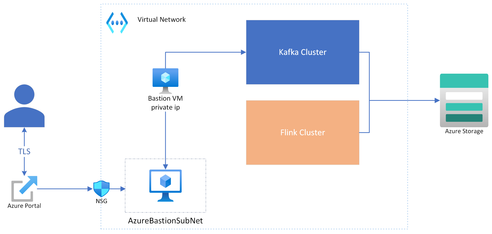
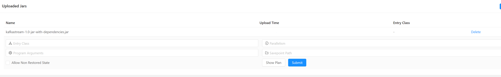
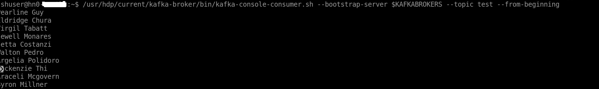

## Network Topology

## Kafka Topic Setup

- Connect to Bastion VM using Bastion Service.
- ssh to kafka head node ip address (you can find kafka head node from Ambari -> Hosts -> hn0xxxx/hn1xxxxx) using following command
  - ssh sshuser@<headnode ip address>
  - enter Ambari password

Once successfully logged on to the Kafka head node, please run the following commands to create a Kafka topic.

### Environment Variable Setup
sudo apt install jq
export password='<ambari password'
export clusterName=$(curl -u admin:$password -sS -G "http://headnodehost:8080/api/v1/clusters" | jq -r '.items[].Clusters.cluster_name')
export KAFKAZKHOSTS=$(curl -sS -u admin:$password -G https://$clusterName.azurehdinsight.net/api/v1/clusters/$clusterName/services/ZOOKEEPER/components/ZOOKEEPER_SERVER | jq -r '["\(.host_components[].HostRoles.host_name):2181"] | join(",")' | cut -d',' -f1,2);
export KAFKABROKERS=$(curl -sS -u admin:$password -G https://$clusterName.azurehdinsight.net/api/v1/clusters/$clusterName/services/KAFKA/components/KAFKA_BROKER | jq -r '["\(.host_components[].HostRoles.host_name):9092"] | join(",")' | cut -d',' -f 1,2);

### Create Topic
/usr/hdp/current/kafka-broker/bin/kafka-topics.sh --create --replication-factor 3 --partitions 8 --topic <topic name> --zookeeper $KAFKAZKHOSTS

## Start Console Consumer
/usr/hdp/current/kafka-broker/bin/kafka-console-consumer.sh --bootstrap-server $KAFKABROKERS --topic <topic name> --from-beginning

## Running Stream Example

You can run the Flink stream job from the Azure portal in a couple of ways:

### Using Flink Dashboard

- Browse Flink Dashboard from Cluster Pool (created in Platform Setup step#4)
- Select the Flink Cluster
- Open Flink Dashboard from "Apache Flink"

  

- Click on "Submit New Job" -> "+ Add New" to add jar file created from maven build `<source directory>\kafkastream-examples\target\kafkastream-1.0-jar-with-dependencies.jar`
  

- Selected/Click on newly uploaded jar

   

- Provide following inputs to run kafka stream producer example
    - Entry Class :  `com.ms.hdi.hilo.flink.stream.kafka.producer.FlinkKafkaCustomerProducer`
    - Program Arguments: `--topicName <topic name> --kafkaBootstrapServers '<kafka brokers>'`

You can get list of kafka brokers from the Kafka head node (variable value from Environment Variable Setup  $KAFKABROKERS)

The console consumer should stream a list of names on the console.

### Using HDInsight Flink Job Management

HDInsight on AKS provides a feature to manage and submit Apache Flink jobs directly through the Azure portal (user-friendly interface) and ARM Rest APIs.

Please refer [this page](https://learn.microsoft.com/en-us/azure/hdinsight-aks/flink/flink-job-management) for more detail.